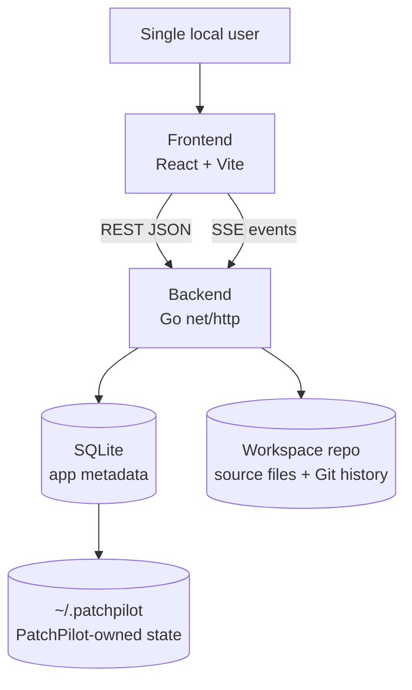
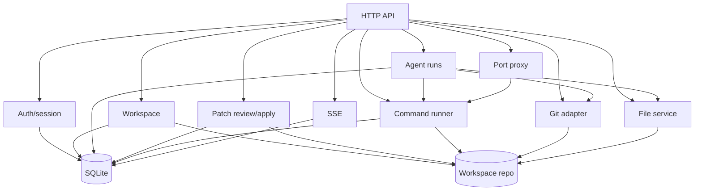
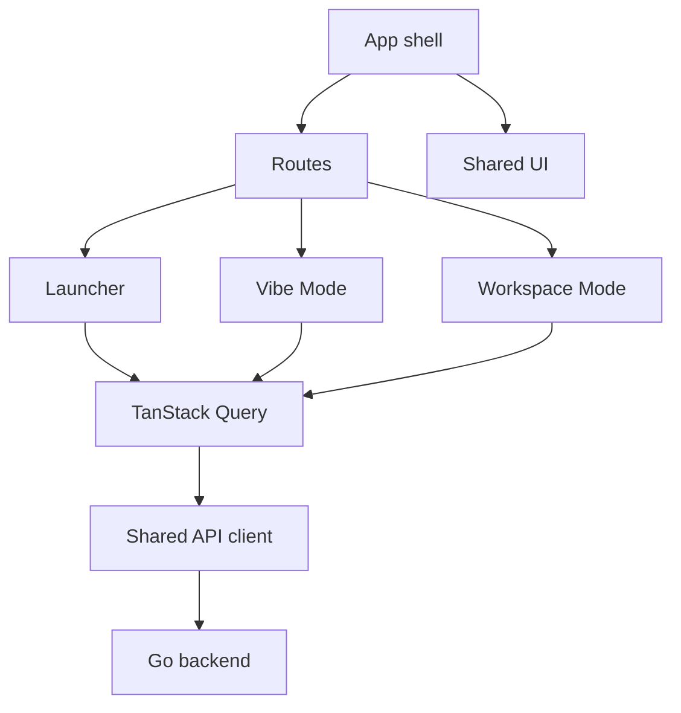
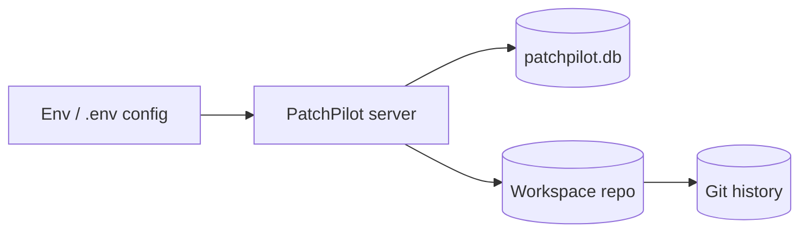
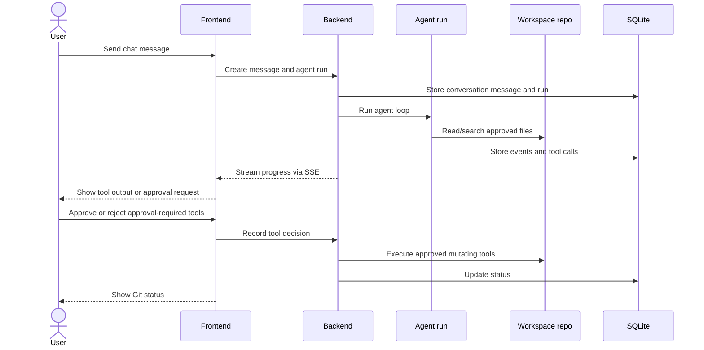

# PatchPilot Architecture

This document summarizes the current architecture. `docs/project-rules.md` and `docs/product-spec.md` remain the source of truth for locked rules, scope, APIs, and data contracts.

## Overview

PatchPilot is a single-user, self-hosted app. The browser UI talks to the Go backend through REST and SSE. SQLite stores PatchPilot metadata. Workspace files stay in their original Git repository.

## Backend

Backend modules:

- `cmd/patchpilot`: application entrypoint.
- `internal/api`: HTTP routes, handlers, SSE, and preview proxy.
- `internal/config`: runtime configuration.
- `internal/database`: SQLite connection and manual migrations.
- `internal/workspace`: allowed workspace validation and metadata.
- `internal/filestore`: safe workspace file access.
- `internal/gitrepo`: Git status, diff, and commit operations.
- `internal/runner`: workspace-root command execution.
- `internal/events`: SSE fan-out for realtime command lifecycle and output.

The command runner creates durable command records before process start, runs
commands without a shell from the workspace root, appends stdout/stderr chunks
to SQLite, and publishes `process.started`, `command.output`, and
`process.exited` events. SSE clients receive live events plus durable command
replay for the latest output.

## Frontend

Frontend modules:

- `web/src/app`: shell, routes, theme, default route behavior.
- `web/src/features/vibe`: conversation chat, agent run activity, and tool approval.
- `web/src/features/workspace`: files, Git, commands, and preview tools.
- `web/src/shared/api`: typed API functions over the shared Axios client.
- `web/src/shared/ui`: reusable UI primitives.
- `web/src/shared/styles`: global Tailwind theme and CSS.

## Storage

SQLite stores conversations, messages, agent runs, events, tool calls, commands, command output, ports, and Git snapshots. Source files remain on disk in the workspace repo.

## Agent Tool Flow

Agents inspect approved context and request tools. File mutations happen only through approved tool execution.
