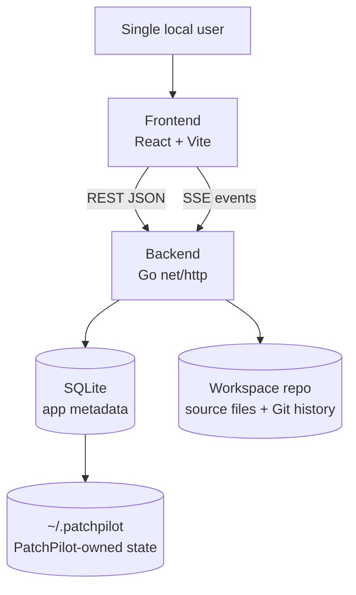
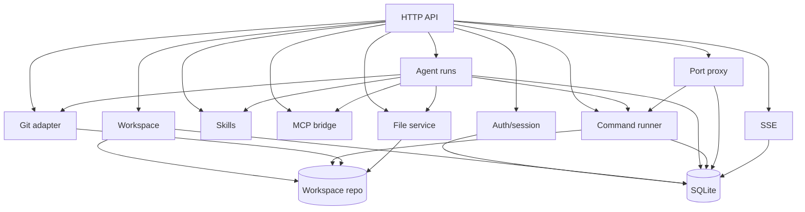
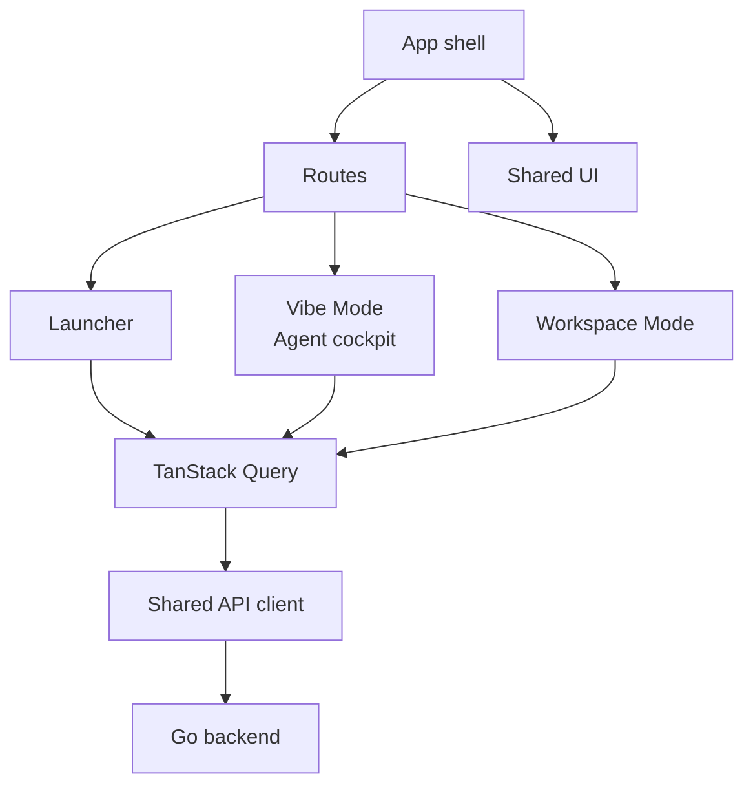
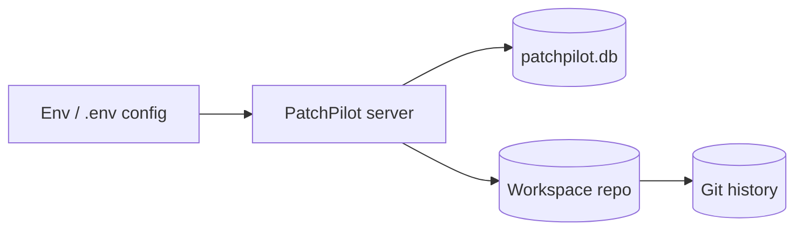
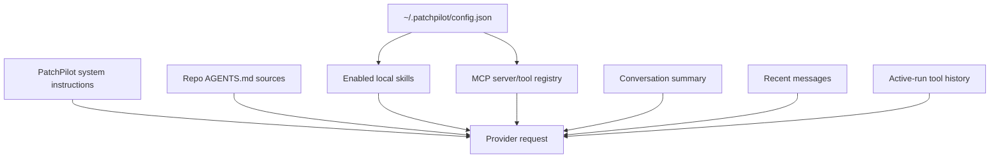
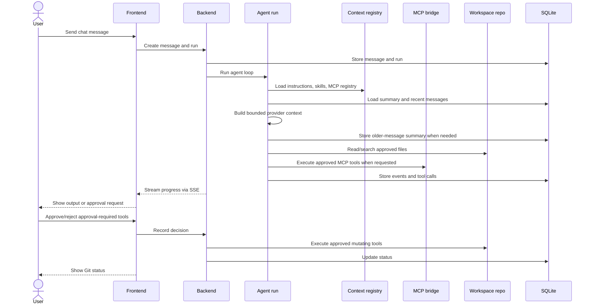

# PatchPilot Architecture

Current architecture summary. `docs/project-rules.md` and `docs/product-spec.md` remain authoritative for locked rules, scope, APIs, and data contracts.

## Overview

PatchPilot is a single-user, self-hosted app. Browser UI talks to the Go backend through REST and SSE. SQLite stores PatchPilot metadata. Workspace files remain in their Git repo.

## Backend

Modules:

- `cmd/patchpilot`: entrypoint.
- `internal/api`: routes, handlers, SSE, preview proxy.
- `internal/config`: runtime config.
- `internal/database`: SQLite connection and manual migrations.
- `internal/workspace`: allowed workspace validation and metadata.
- `internal/filestore`: safe workspace file access.
- `internal/gitrepo`: Git status, diff, commit operations.
- `internal/runner`: workspace-root command execution.
- `internal/skills`: local skill registry, `SKILL.md` indexing, bounded skill context.
- `internal/mcp`: local MCP server config discovery and backend-only tool metadata.
- `internal/ports`: same-host listener scanning and preview proxy support.
- `internal/events`: SSE fan-out for command lifecycle/output.

Command runner flow: create durable record before process start, run without shell at workspace root, append stdout/stderr chunks to SQLite, publish `process.started`, `command.output`, `process.exited`, and replay latest retained output to SSE clients.

## Frontend

Modules:

- `web/src/app`: shell, routes, theme, default routing.
- `web/src/features/vibe`: conversation chat, agent cockpit, run activity, tool approval.
- `web/src/features/workspace`: files, Git, commands, preview tools.
- `web/src/shared/api`: typed API functions over shared Axios client.
- `web/src/shared/ui`: reusable UI primitives.
- `web/src/shared/styles`: global Tailwind theme/CSS.

## Storage

SQLite stores conversations, messages, agent runs/events/tool calls, command
records/output, ports, and Git snapshots. `AGENTS.md` is read directly from
workspace filesystem on context refresh/run creation. `~/.patchpilot/config.json`
plus filesystem skill discovery remain source of truth for Skills/MCP lists; v0.3
derives those lists at runtime instead of persisting them. Conversations persist
`hasRunningRun` so Vibe can show in-flight state without listing every run.
Source files stay in the workspace repo.

## Agent Context

Agent context is assembled server-side. PatchPilot loads `~/.patchpilot/config.json`, reads applicable `AGENTS.md`, discovers skills from `~/.patchpilot/skills` then `~/.agents/skills`, and discovers enabled MCP servers from config before a run. Duplicate skill keys select only the `~/.patchpilot/skills` copy. Provider priority: developer control instructions, repo instructions, selected skills, MCP registry, current prompt, tool schemas, active-run history, conversation summary, recent messages. Control instructions are sent as explicit developer-role messages whose `content` array contains XML-tagged system prompt blocks, including skill instructions. Repo `AGENTS.md` instructions, structured environment context (`cwd`, `shell`, `current_date`, `timezone`), and context warnings are sent separately as a user-role context message before user/assistant conversation history. Instruction/skill/MCP context passes workspace-root, symlink, secret, size, and host-path redaction checks before provider use.

## Agent Tool Flow

Agents inspect approved context and request built-in/MCP tools. Conversation history is bounded before provider calls: summaries cover older messages, recent messages stay verbatim, and developer control instructions, repo instructions, selected skills, and MCP metadata remain separate from conversation content. File mutations and unknown/mutating MCP calls happen only through approved tool execution.
