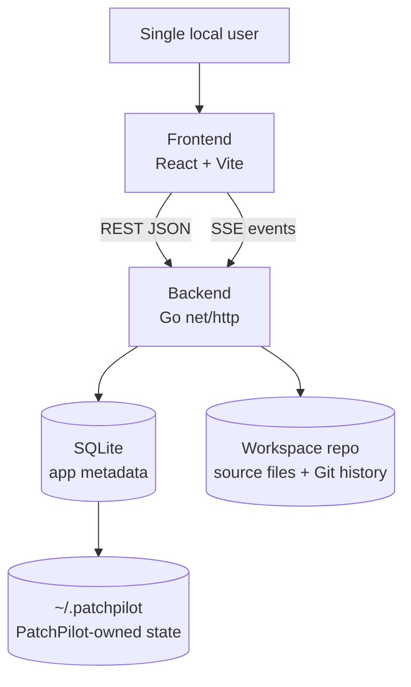
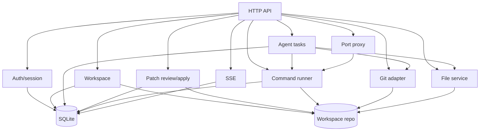
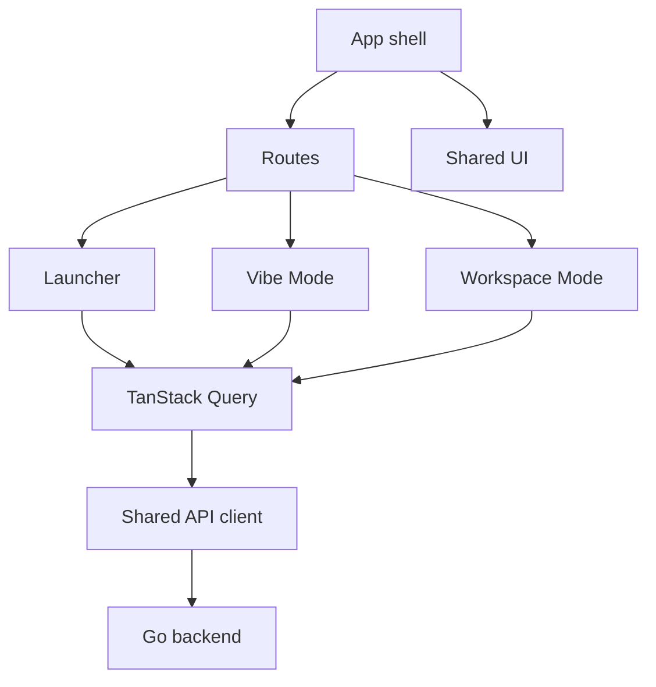
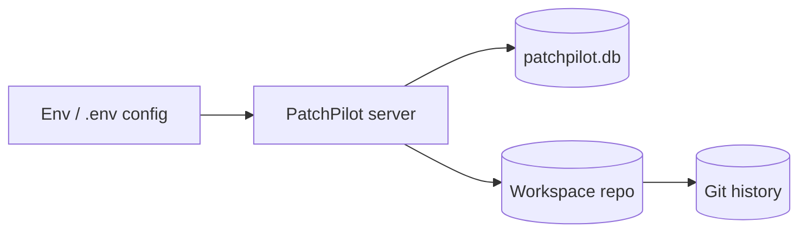
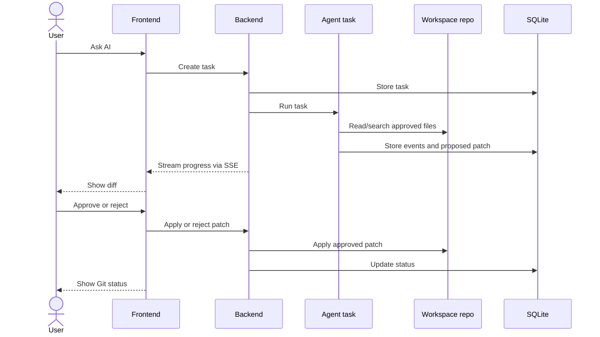

# PatchPilot Architecture

This document summarizes the MVP architecture. `docs/project-rules.md` and `docs/mvp-spec.md` remain the source of truth for locked rules, scope, APIs, and data contracts.

## Overview

PatchPilot is a single-user, self-hosted app. The browser UI talks to the Go backend through REST and SSE. SQLite stores PatchPilot metadata. Workspace files stay in their original Git repository.

## Backend

Backend modules:

- `cmd/patchpilot`: application entrypoint.
- `internal/api`: HTTP routes, handlers, SSE, and preview proxy.
- `internal/config`: runtime configuration.
- `internal/database`: SQLite connection and schema setup.
- `internal/workspace`: allowed workspace validation and metadata.
- `internal/filestore`: safe workspace file access.
- `internal/gitrepo`: Git status, diff, and commit operations.
- `internal/runner`: workspace-root command execution.

## Frontend

Frontend modules:

- `web/src/app`: shell, routes, theme, default route behavior.
- `web/src/features/vibe`: AI task flow and patch review.
- `web/src/features/workspace`: files, Git, commands, and preview tools.
- `web/src/shared/api`: typed API functions over the shared Axios client.
- `web/src/shared/ui`: reusable UI primitives.
- `web/src/shared/styles`: global Tailwind theme and CSS.

## Storage

SQLite stores sessions, workspaces, agent tasks, events, patches, commands, command output, ports, and Git snapshots. Source files remain on disk in the workspace repo.

## Patch Flow

Agents inspect approved context and propose patches. File mutations happen only after explicit user approval.
